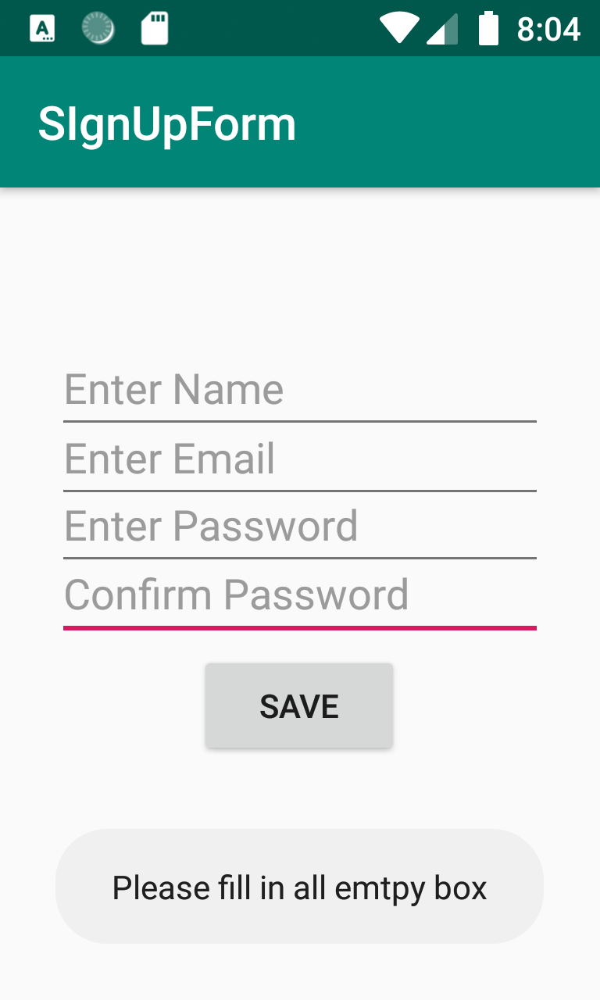
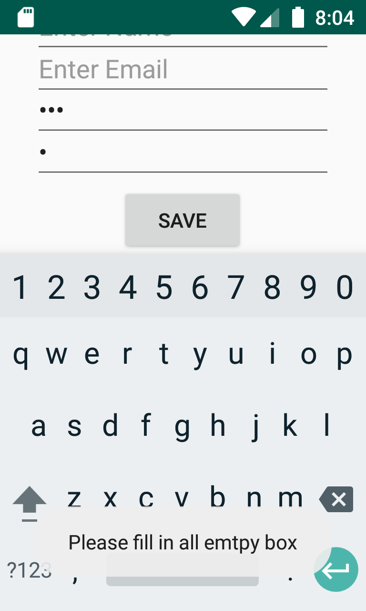
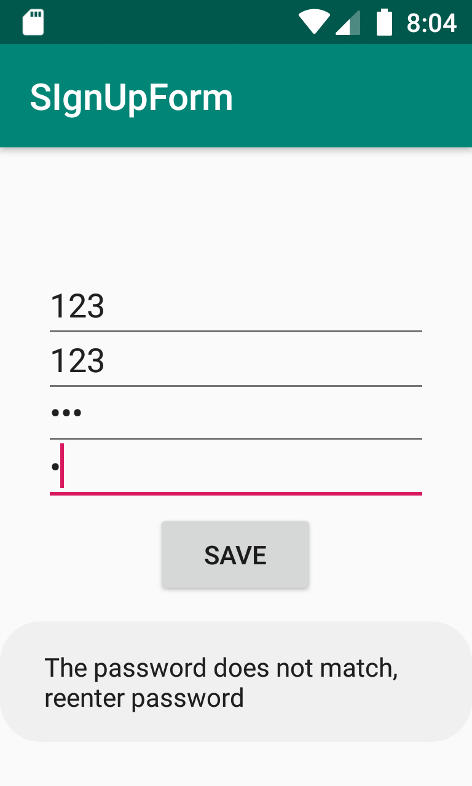

# SignUpForm
A sign up form for user input on information
User enter information and a message will display to let user know if they left a empty box or that their password does not match.

Without Inputs

With only some input

Non matching password

